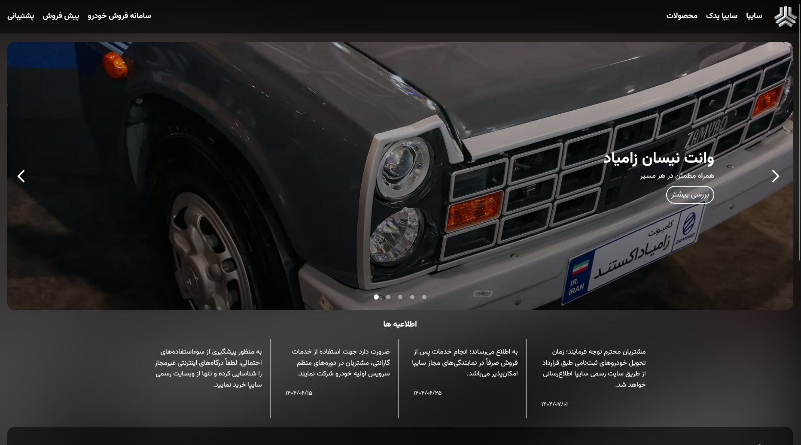
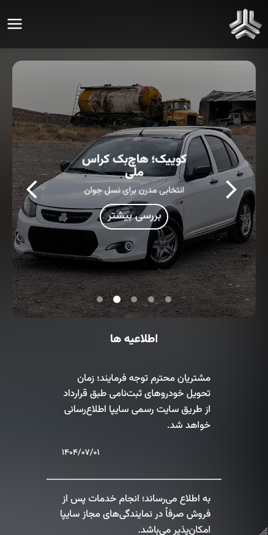

# new-saipa

پروژه‌ی new-saipa یک نمونه‌کار Frontend است که با React.js ساخته شده و هدف آن بازطراحی صفحه اصلی سایت سایپا به صورت ریسپانسیو برای نمایش در موبایل و دسکتاپ است.

**این پروژه صرفاً یک نمونه کار شخصی است و کار رسمی سایپا نمی‌باشد**


<div style="text-align: center">

[](media/desktop.mp4)<br>
[](media/mobile.mp4)

</div>


## ویژگی‌ها

- طراحی کاملاً ریسپانسیو (Mobile & Desktop)
- استفاده از React.js برای ساختار مدرن و سریع رابط کاربری- طراحی ساده، تمیز و قابل شخصی‌سازی

## پیش‌نیازها

برای اجرای پروژه به موارد زیر نیاز دارید:
- Node.js
- npm یا yarn
- مرورگر مدرن (Chrome, Firefox, Edge)

## نصب و راه‌اندازی

مخزن پروژه را کلون کنید:
```
git clone https://github.com/mohammad3a1eh/new-saipa.git
```
وارد پوشه پروژه شوید:
```
cd new-saipa
cd frontend
```
پکیج‌ها را نصب کنید:
```
npm install
# یا
yarn install
```
پروژه را اجرا کنید:
```
npm run dev
# یا
yarn run dev
```

## استفاده
- این پروژه نمونه کار است و می‌توانید برای تمرین React، طراحی ریسپانسیو یا نمونه‌سازی صفحات وب از آن استفاده کنید.
- طراحی‌ها قابل تغییر و شخصی‌سازی هستند و می‌توان آنها را به پروژه‌های دیگر منتقل کرد.
